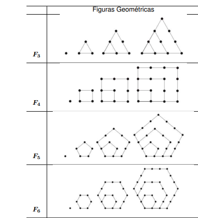

# Padrões III

Considere as seguintes sequências de figuras geométricas:





Dado dois inteiros $1 \leq n \leq 3$ e $ 1 \leq m \leq 40$, encontre o número de pontos da m-ésima figura da sequência $F_n$. Por exemplo, a segunda figura da sequência $F_3$ é formada por 3 pontos.


**Entrada**

A entrada é composta por uma única linha contendo dois inteiros n e m representando o m-ésima figura da sequência $F_n$.

**Saída**

A saída é composta por uma única linha contendo o número total de pontos.

**Exemplo de Entrada**
```
6 2
```

**Exemplo de Saída**
```
6
```


